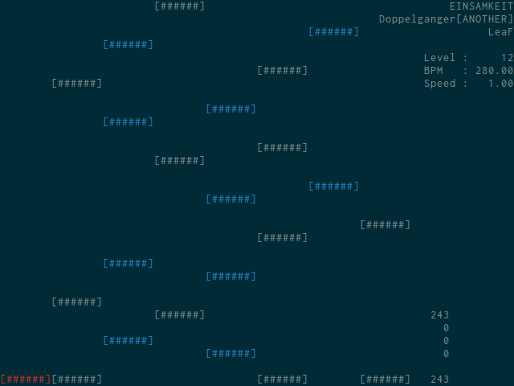

Shinonome
================================

A console-based BMS player.



Installation and Usage
--------------------------------

```console
$ git clone git://github.com/kuroclef/shinonome.git
$ cd shinonome; make
$ ./shinonome --help
```

Or PKGBUILD for Arch Linux is [available here][shinonome-git].  
Type `$ yaourt -S shinonome-git` on your command line.

[shinonome-git]:https://aur.archlinux.org/packages/shinonome-git

Dependencies
--------------------------------

- ncurses
- SDL2
- SDL2_mixer

Copyright and License
--------------------------------

Copyright (C) 2015 Kazumi Moriya \<kuroclef@gmail.com>  
Licensed under the GNU General Public License v3.0
